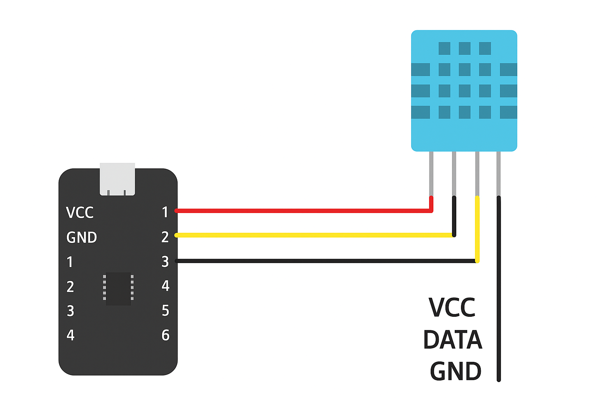

# Smart-Table

This project implements a **simple version** of a smart table.
It measures **temperature and humidity**, and depending on the desired temperature and the current temperature, the fan adjusts its power to **optimally cool the environment.**
All data is displayed on a screen and **updates in real time.**

#### Additionally, another sensor monitors how long the user has been sitting. If the user sits for a time equal to or longer than the value specified in the configuration, a message will appear on the display and the buzzer will play a sound.

#### Finally, after the period defined in the configuration, the Telegram bot will send statistics represented as a line graph, showing temperature and humidity changes over time, along with important notifications such as “User has been sitting too long.”

## How to start
```bash
git clone https://github.com/SegFaultTeam/Smart-Table/
cd BOT
npm install
touch .env
nano .env
# Insert your TELEGRAM_API_KEY
cd ..
cd table/build
make
cd ../../pico2/build
make
```

**You will need two Raspberry Pi Pico boards.**

#### Copy the generated .uf2 files to each board.

For this project you will need:

## DHT sensor


- Display

- Fan

- Buzzer

- Distance sensor

After wiring everything correctly, the system should work.

## Enjoy!
